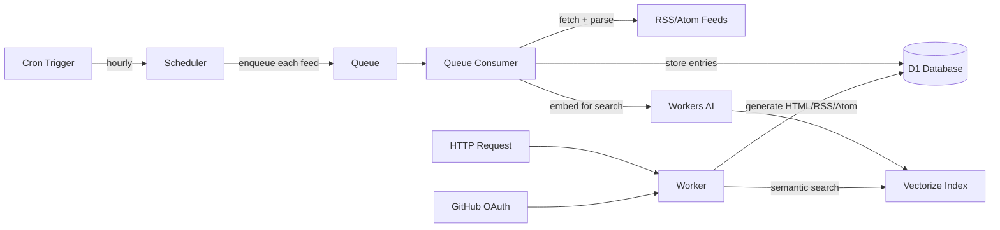

# Planet CF

A feed aggregator that runs entirely on Cloudflare Workers. Aggregate RSS and Atom feeds from across the web into a single, searchable page — deployed at the edge with no servers to manage.

[](https://deploy.workers.cloudflare.com/?url=https://github.com/adewale/planet_cf)

## Features

- **Hourly feed aggregation** — subscribe to RSS/Atom feeds and get a unified, auto-updating page
- **Semantic search** — find posts by meaning, not just keywords, powered by Vectorize and Workers AI
- **Multi-format output** — HTML, RSS 2.0, Atom, RSS 1.0 (RDF), OPML, and FOAF
- **Themeable** — ship with 3 built-in themes (default, planet-python, planet-mozilla) or create your own
- **Admin dashboard** — manage feeds, import OPML, view health stats, all behind GitHub OAuth
- **Resilient feed processing** — automatic retries, dead-letter queue, feed health tracking, and auto-recovery
- **Zero-server deployment** — everything runs on Cloudflare's free or paid tier with no origin servers

## Cloudflare Services

| Service | Purpose |
|---------|---------|
| Workers (Python) | Request handling, feed processing, HTML generation |
| D1 | Feed and entry storage (serverless SQLite) |
| Vectorize | Semantic search index |
| Workers AI | Embedding generation for search |
| Queues | Reliable feed fetch pipeline with dead-letter queue |
| Static Assets | CSS/JS served at the edge |

## Quick Start

### Prerequisites

- [Cloudflare account](https://dash.cloudflare.com/sign-up)
- [Node.js](https://nodejs.org/) (for wrangler CLI)
- [uv](https://docs.astral.sh/uv/) (Python package manager)

### 1. Clone and install

```bash
git clone https://github.com/adewale/planet_cf.git
cd planet_cf
uv sync
npm install
```

> **Note on wrangler:** `npm install` only installs the JS test tooling (jsdom, vitest); it does **not** install wrangler. Every `npx wrangler ...` command below downloads wrangler on first use (an unpinned version). There is nothing to install separately.

### 2. Bundle Python dependencies

Cloudflare Python Workers require their pip dependencies vendored into a `python_modules/` directory:

```bash
make python-modules
```

`make python-modules` copies packages out of a pre-built Pyodide virtualenv at `.venv-workers/pyodide-venv/`. That venv is produced by the Cloudflare Workers tooling (`workers-py`, `workers-runtime-sdk`) declared in the `workers` dependency group, **not** by a plain `uv sync`. If `make python-modules` reports that `.venv-workers/pyodide-venv` is missing, you do not yet have that venv.

The simplest supported path is to let **`./scripts/deploy_instance.sh`** drive the deploy: it validates `python_modules/`, runs every migration in order, and tells you exactly what to fix if a step is missing. The manual steps below are provided for understanding, but the deploy script is the recommended route. See [docs/MULTI_INSTANCE.md](docs/MULTI_INSTANCE.md).

### 3. Create Cloudflare resources

The committed root `wrangler.jsonc` is the **test-planet** config — it is named `test-planet` and binds resources called `test-planet-db`, `test-planet-entries`, `test-planet-feed-queue`, and `test-planet-feed-dlq`. It does **not** match the resource names below, and you should not deploy it as-is for your own planet.

Create your own resources (use any names you like — these are examples), then put the resulting IDs/names into your own config:

```bash
npx wrangler d1 create my-planet-db
npx wrangler vectorize create my-planet-entries --dimensions=768 --metric=cosine
npx wrangler queues create my-planet-feed-queue
npx wrangler queues create my-planet-feed-dlq
```

Copy one of the `examples/*/wrangler.jsonc` files (or generate one with `python scripts/create_instance.py`), and edit it so the worker `name`, the D1 `database_name` + `database_id`, the Vectorize `index_name`, and the queue names all match the resources you just created. The `database_id` printed by `wrangler d1 create` must be pasted into your config — wrangler cannot infer it.

### 4. Apply database migrations

Apply **all** migrations, in order — not just `001_initial.sql`. Migrations 003/004 add columns (`entries.first_seen`, `feeds.last_entry_at`) that the code writes on every fetch; with only `001` applied, a fresh instance can never store an entry.

```bash
for f in migrations/*.sql; do
  npx wrangler d1 execute my-planet-db --remote --file="$f"
done
```

(Or just run `./scripts/deploy_instance.sh <id>`, which applies every migration for you.)

### 5. Set up GitHub OAuth

1. Go to [GitHub Developer Settings](https://github.com/settings/developers) and create a new OAuth App
2. Set the callback URL to `https://your-worker.workers.dev/auth/github/callback`
3. Configure the secrets:

```bash
npx wrangler secret put GITHUB_CLIENT_ID
npx wrangler secret put GITHUB_CLIENT_SECRET

# Generate and set a session signing key
openssl rand -hex 32
npx wrangler secret put SESSION_SECRET
```

For production, also set `OAUTH_REDIRECT_URI` (in your config `vars`) to your exact callback URL — e.g. `https://your-worker.workers.dev/auth/github/callback`. If it is unset, the OAuth flow falls back to the request origin, which is less safe behind proxies.

### 6. Add yourself as admin

```bash
npx wrangler d1 execute my-planet-db --remote --command \
  "INSERT INTO admins (github_username, display_name, is_active) VALUES ('YOUR_GITHUB_USERNAME', 'Your Name', 1);"
```

Use your exact GitHub login name (e.g., `adewale`, not `@adewale`).

### 7. Deploy

```bash
npx wrangler deploy --config <your-config>.jsonc
```

> **Automatic hourly fetching needs a cron.** The committed root `wrangler.jsonc` has `"crons": []`, so a worker deployed from it never fetches feeds on a schedule. Use a config with a cron trigger configured (the `examples/*/wrangler.jsonc` and `wrangler.production.jsonc` include one), or add `"triggers": { "crons": ["0 * * * *"] }` to your own config. You can still fetch on demand from the admin dashboard.

### 8. Custom domain (optional)

Workers on `*.workers.dev` don't benefit from Cloudflare's edge cache — every request runs the Worker. If you add a [custom domain](https://developers.cloudflare.com/workers/configuration/routing/custom-domains/), Cloudflare caches responses at the edge and serves them in ~20-50ms.

To enable global cache purging after admin actions (so changes appear immediately worldwide instead of waiting up to 1 hour):

```bash
npx wrangler secret put CLOUDFLARE_ZONE_ID    # from your domain's Cloudflare dashboard
npx wrangler secret put CLOUDFLARE_API_TOKEN   # API token with Cache Purge permission
```

Without these secrets, cache purging still works but only clears the local edge location. See [docs/CACHING.md](docs/CACHING.md) for details.

## Public Routes

| URL | Description |
|-----|-------------|
| `/` | Main aggregated feed page |
| `/titles` | Titles-only view |
| `/feed.atom` | Atom feed |
| `/feed.rss` | RSS 2.0 feed |
| `/feed.rss10` | RSS 1.0 (RDF) feed |
| `/feeds.opml` | OPML export of all subscriptions |
| `/foafroll.xml` | FOAF RDF feed |
| `/search` | Semantic search (full mode only) |
| `/health` | Health check endpoint |
| `/admin` | Admin dashboard (GitHub OAuth) |

## Configuration

All settings have sensible defaults. Override them via environment variables in `wrangler.jsonc`:

```jsonc
{
  "vars": {
    "PLANET_NAME": "My Custom Planet",
    "RETENTION_DAYS": "60",
    "INSTANCE_MODE": "lite",
    "THEME": "planet-python"
  }
}
```

<details>
<summary>Full configuration reference</summary>

### Instance settings

| Setting | Default | Env var |
|---------|---------|---------|
| Planet name | "Planet CF" | `PLANET_NAME` |
| Planet description | "Aggregated posts from Cloudflare employees and community" | `PLANET_DESCRIPTION` |
| Theme | `default` | `THEME` |
| Instance mode | `full` | `INSTANCE_MODE` — `full` enables search; `lite` disables it |
| Footer text | "Powered by Planet CF" | `FOOTER_TEXT` |
| Planet URL | `https://www.planetcloudflare.dev` | `PLANET_URL` |
| Show admin link | mode-dependent (shown in full mode, hidden in lite) | `SHOW_ADMIN_LINK` — set `true`/`false` to override |
| Hide sidebar links | false | `HIDE_SIDEBAR_LINKS` |
| Planet owner name | "Planet CF" | `PLANET_OWNER_NAME` (used in OPML/FOAF/User-Agent) |
| Planet owner email | (unset) | `PLANET_OWNER_EMAIL` (used in the User-Agent string) |
| User-Agent template | built-in | `USER_AGENT_TEMPLATE` (supports `{name}`, `{url}`, `{email}`) |
| Enable RSS 1.0 link | theme-dependent | `ENABLE_RSS10` — `true` to advertise `/feed.rss10` |
| Enable FOAF link | theme-dependent | `ENABLE_FOAF` — `true` to advertise `/foafroll.xml` |

### Feed processing

| Setting | Default | Env var |
|---------|---------|---------|
| Homepage display window | 90 days | `RETENTION_DAYS` (entries older than this are not shown — and are pruned from D1) |
| Sidebar "recent" window | 7 days | `CONTENT_DAYS` (controls only the per-feed recent list in the sidebar, not the main page) |
| HTTP timeout | 30 seconds | `HTTP_TIMEOUT_SECONDS` |
| Feed processing timeout | 60 seconds | `FEED_TIMEOUT_SECONDS` |
| Max entries per feed | 100 | `RETENTION_MAX_ENTRIES_PER_FEED` |
| Unhealthy threshold | 3 failures | `FEED_FAILURE_THRESHOLD` |
| Auto-deactivate after | 10 failures | `FEED_AUTO_DEACTIVATE_THRESHOLD` |
| Feed recovery | enabled | `FEED_RECOVERY_ENABLED` |
| Feed recovery limit | 2 per run | `FEED_RECOVERY_LIMIT` |

### Search (full mode only)

| Setting | Default | Env var |
|---------|---------|---------|
| Max embedding chars | 2000 | `EMBEDDING_MAX_CHARS` |
| Top-K results | 50 | `SEARCH_TOP_K` |
| Score threshold | 0.3 | `SEARCH_SCORE_THRESHOLD` |

### Smart defaults

- **Fallback content**: When no entries exist within the homepage display window (`RETENTION_DAYS`), the homepage shows the 50 most recent entries instead of an empty page
- **Theme fallback**: If a specified theme doesn't exist, the build falls back to `default` instead of erroring
- **Auto-initialization**: Database tables are created automatically on first request

</details>

## Multi-Instance Deployment

Planet CF supports deploying multiple independent instances from a single codebase. Ready-to-deploy examples are included:

| Example | Description |
|---------|-------------|
| `examples/default/` | Minimal lite-mode starting point |
| `examples/planet-cloudflare/` | Full-featured configuration |
| `examples/planet-python/` | Planet Python clone (500+ feeds) |
| `examples/planet-mozilla/` | Planet Mozilla clone (207 feeds) |

```bash
# Deploy an example
./scripts/deploy_instance.sh planet-python

# Create a new instance
python scripts/create_instance.py --id my-planet --name "My Planet" --deploy
```

See [docs/MULTI_INSTANCE.md](docs/MULTI_INSTANCE.md) for details.

## Architecture



- **Scheduler** runs hourly via cron, enqueuing each feed as a separate queue message
- **Queue Consumer** fetches feeds with timeout protection, retries, and dead-lettering
- **HTTP Handler** generates HTML/RSS/Atom on demand, cached at the edge for 1 hour
- **Auth** uses stateless GitHub OAuth with HMAC-signed session cookies

## Development

```bash
# Install the test dependencies (pytest et al. live in the "test" extra).
# A plain `uv sync` does NOT install them, and the suite will fail to collect.
uv sync --extra test

# Start local dev server
npx wrangler dev

# Apply ALL local migrations (in another terminal), not just 001
for f in migrations/*.sql; do
  npx wrangler d1 execute my-planet-db --local --file="$f"
done

# Run tests (unit + integration). Run `uv run pytest tests/unit tests/integration --co -q | tail -1`
# for the current count; the suite is ~1,400 tests and takes ~30s.
uv run pytest tests/unit tests/integration -x -q

# Lint and type check
uvx ruff check .
uvx ruff format --check .
uvx ty check src/
uvx --python 3.12 vulture src/ vulture_whitelist.py
```

## Scripts

| Script | Description |
|--------|-------------|
| `build_templates.py` | Compile HTML templates into `src/templates.py` |
| `create_instance.py` | Provision a new instance with all Cloudflare resources |
| `deploy_instance.sh` | Deploy an instance (D1, Vectorize, Queues, secrets, migrations) |
| `validate_deployment_ready.py` | Pre-deploy check for common issues |
| `verify_deployment.py` | Post-deploy smoke tests |
| `convert_planet.py` | Convert a Planet/Venus site into a Planet CF instance |
| `seed_feeds_from_opml.py` | Import feeds from an OPML file into D1 |
| `seed_admins.py` | Seed admin users from `config/admins.json` into D1 |
| `seed_test_data.py` | Load fixture feeds/entries (and a test admin) for E2E testing |
| `setup_test_planet.sh` | One-command bootstrap of a personal test-planet instance |
| `visual_compare.py` | Screenshot/visual-diff helper for theme work |

## Documentation

| Topic | Link |
|-------|------|
| Architecture | [docs/ARCHITECTURE.md](docs/ARCHITECTURE.md) |
| Multi-instance deployment | [docs/MULTI_INSTANCE.md](docs/MULTI_INSTANCE.md) |
| Lite mode | [docs/LITE_MODE.md](docs/LITE_MODE.md) |
| Conversion guide | [docs/CONVERSION_GUIDE.md](docs/CONVERSION_GUIDE.md) |
| Design guide | [docs/DESIGN_GUIDE.md](docs/DESIGN_GUIDE.md) |
| Observability | [docs/OBSERVABILITY.md](docs/OBSERVABILITY.md) |
| Performance | [docs/PERFORMANCE.md](docs/PERFORMANCE.md) |
| Testing | [docs/TESTING.md](docs/TESTING.md) |

## Acknowledgments

Inspired by [Planet](https://www.planetplanet.org/) and [Venus](https://github.com/rubys/venus), the original feed aggregators that powered community blog rolls across the open-source world.

## License

This project is licensed under the [MIT License](LICENSE).
