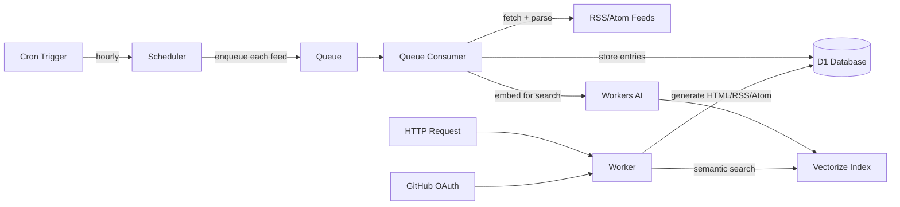

# Planet CF

A feed aggregator that runs entirely on Cloudflare Workers. Aggregate RSS and Atom feeds from across the web into a single, searchable page — deployed at the edge with no servers to manage.

[](https://deploy.workers.cloudflare.com/?url=https://github.com/adewale/planet_cf)

## Features

- **Hourly feed aggregation** — subscribe to RSS/Atom feeds and get a unified, auto-updating page
- **Semantic search** — find posts by meaning, not just keywords, powered by Vectorize and Workers AI
- **Multi-format output** — HTML, RSS 2.0, Atom, RSS 1.0 (RDF), OPML, and FOAF
- **Themeable** — ship with 3 built-in themes (default, planet-python, planet-mozilla) or create your own
- **Admin dashboard** — manage feeds, import OPML, view health stats, all behind GitHub OAuth
- **Resilient feed processing** — automatic retries, dead-letter queue, feed health tracking, and auto-recovery
- **Zero-server deployment** — everything runs on Cloudflare's free or paid tier with no origin servers

## Cloudflare Services

| Service | Purpose |
|---------|---------|
| Workers (Python) | Request handling, feed processing, HTML generation |
| D1 | Feed and entry storage (serverless SQLite) |
| Vectorize | Semantic search index |
| Workers AI | Embedding generation for search |
| Queues | Reliable feed fetch pipeline with dead-letter queue |
| Static Assets | CSS/JS served at the edge |

## Quick Start

### Prerequisites

- [Cloudflare account](https://dash.cloudflare.com/sign-up)
- [Node.js](https://nodejs.org/) (for wrangler CLI)
- [uv](https://docs.astral.sh/uv/) (Python package manager)

### 1. Clone and install

```bash
git clone https://github.com/adewale/planet_cf.git
cd planet_cf
uv sync
npm install
```

### 2. Bundle Python dependencies

Cloudflare Python Workers require bundled pip dependencies:

```bash
make python-modules
```

### 3. Create Cloudflare resources

```bash
npx wrangler d1 create planetcf
npx wrangler vectorize create planetcf-entries --dimensions=768 --metric=cosine
npx wrangler queues create planetcf-feed-queue
npx wrangler queues create planetcf-feed-dlq
```

Update `wrangler.jsonc` with your database ID from the output above.

### 4. Apply database migrations

```bash
npx wrangler d1 execute planetcf --remote --file=migrations/001_initial.sql
```

### 5. Set up GitHub OAuth

1. Go to [GitHub Developer Settings](https://github.com/settings/developers) and create a new OAuth App
2. Set the callback URL to `https://your-worker.workers.dev/auth/github/callback`
3. Configure the secrets:

```bash
npx wrangler secret put GITHUB_CLIENT_ID
npx wrangler secret put GITHUB_CLIENT_SECRET

# Generate and set a session signing key
openssl rand -hex 32
npx wrangler secret put SESSION_SECRET
```

### 6. Add yourself as admin

```bash
npx wrangler d1 execute planetcf --remote --command \
  "INSERT INTO admins (github_username, display_name, is_active) VALUES ('YOUR_GITHUB_USERNAME', 'Your Name', 1);"
```

Use your exact GitHub login name (e.g., `adewale`, not `@adewale`).

### 7. Deploy

```bash
npx wrangler deploy
```

## Public Routes

| URL | Description |
|-----|-------------|
| `/` | Main aggregated feed page |
| `/titles` | Titles-only view |
| `/feed.atom` | Atom feed |
| `/feed.rss` | RSS 2.0 feed |
| `/feed.rss10` | RSS 1.0 (RDF) feed |
| `/feeds.opml` | OPML export of all subscriptions |
| `/foafroll.xml` | FOAF RDF feed |
| `/search` | Semantic search (full mode only) |
| `/health` | Health check endpoint |
| `/admin` | Admin dashboard (GitHub OAuth) |

## Configuration

All settings have sensible defaults. Override them via environment variables in `wrangler.jsonc`:

```jsonc
{
  "vars": {
    "PLANET_NAME": "My Custom Planet",
    "CONTENT_DAYS": "14",
    "INSTANCE_MODE": "lite",
    "THEME": "planet-python"
  }
}
```

<details>
<summary>Full configuration reference</summary>

### Instance settings

| Setting | Default | Env var |
|---------|---------|---------|
| Planet name | "Planet CF" | `PLANET_NAME` |
| Planet description | "Aggregated posts from Cloudflare employees and community" | `PLANET_DESCRIPTION` |
| Theme | `default` | `THEME` |
| Instance mode | `full` | `INSTANCE_MODE` — `full` enables search; `lite` disables it |
| Footer text | "Powered by Planet CF" | `FOOTER_TEXT` |
| Planet URL | `https://www.planetcloudflare.dev` | `PLANET_URL` |
| Show admin link | true | `SHOW_ADMIN_LINK` |
| Hide sidebar links | false | `HIDE_SIDEBAR_LINKS` |

### Feed processing

| Setting | Default | Env var |
|---------|---------|---------|
| Display range | 7 days | `CONTENT_DAYS` |
| HTTP timeout | 30 seconds | `HTTP_TIMEOUT_SECONDS` |
| Feed processing timeout | 60 seconds | `FEED_TIMEOUT_SECONDS` |
| Max entries per feed | 100 | `RETENTION_MAX_ENTRIES_PER_FEED` |
| Retention period | 90 days | `RETENTION_DAYS` |
| Unhealthy threshold | 3 failures | `FEED_FAILURE_THRESHOLD` |
| Auto-deactivate after | 10 failures | `FEED_AUTO_DEACTIVATE_THRESHOLD` |
| Feed recovery | enabled | `FEED_RECOVERY_ENABLED` |
| Feed recovery limit | 2 per run | `FEED_RECOVERY_LIMIT` |

### Search (full mode only)

| Setting | Default | Env var |
|---------|---------|---------|
| Max embedding chars | 2000 | `EMBEDDING_MAX_CHARS` |
| Top-K results | 50 | `SEARCH_TOP_K` |
| Score threshold | 0.3 | `SEARCH_SCORE_THRESHOLD` |

### Smart defaults

- **Fallback content**: When no entries exist in the configured display range, the homepage shows the 50 most recent entries instead of an empty page
- **Theme fallback**: If a specified theme doesn't exist, the build falls back to `default` instead of erroring
- **Auto-initialization**: Database tables are created automatically on first request

</details>

## Multi-Instance Deployment

Planet CF supports deploying multiple independent instances from a single codebase. Ready-to-deploy examples are included:

| Example | Description |
|---------|-------------|
| `examples/default/` | Minimal lite-mode starting point |
| `examples/planet-cloudflare/` | Full-featured configuration |
| `examples/planet-python/` | Planet Python clone (500+ feeds) |
| `examples/planet-mozilla/` | Planet Mozilla clone (190 feeds) |

```bash
# Deploy an example
./scripts/deploy_instance.sh planet-python

# Create a new instance
python scripts/create_instance.py --id my-planet --name "My Planet" --deploy
```

See [docs/MULTI_INSTANCE.md](docs/MULTI_INSTANCE.md) for details.

## Architecture



- **Scheduler** runs hourly via cron, enqueuing each feed as a separate queue message
- **Queue Consumer** fetches feeds with timeout protection, retries, and dead-lettering
- **HTTP Handler** generates HTML/RSS/Atom on demand, cached at the edge for 1 hour
- **Auth** uses stateless GitHub OAuth with HMAC-signed session cookies

## Development

```bash
# Start local dev server
npx wrangler dev

# Apply local migrations (in another terminal)
npx wrangler d1 execute planetcf --local --file=migrations/001_initial.sql

# Run tests (~1200 tests, ~1.4s)
uv run pytest tests/unit tests/integration -x -q

# Lint and type check
uvx ruff check .
uvx ruff format --check .
uvx ty check src/
uvx --python 3.12 vulture src/ vulture_whitelist.py
```

## Scripts

| Script | Description |
|--------|-------------|
| `build_templates.py` | Compile HTML templates into `src/templates.py` |
| `create_instance.py` | Provision a new instance with all Cloudflare resources |
| `deploy_instance.sh` | Deploy an instance (D1, Vectorize, Queues, secrets, migrations) |
| `validate_deployment_ready.py` | Pre-deploy check for common issues |
| `verify_deployment.py` | Post-deploy smoke tests |
| `convert_planet.py` | Convert a Planet/Venus site into a PlanetCF instance |
| `seed_feeds_from_opml.py` | Import feeds from an OPML file into D1 |

## Documentation

| Topic | Link |
|-------|------|
| Architecture | [docs/ARCHITECTURE.md](docs/ARCHITECTURE.md) |
| Multi-instance deployment | [docs/MULTI_INSTANCE.md](docs/MULTI_INSTANCE.md) |
| Lite mode | [docs/LITE_MODE.md](docs/LITE_MODE.md) |
| Conversion guide | [docs/CONVERSION_GUIDE.md](docs/CONVERSION_GUIDE.md) |
| Design guide | [docs/DESIGN_GUIDE.md](docs/DESIGN_GUIDE.md) |
| Observability | [docs/OBSERVABILITY.md](docs/OBSERVABILITY.md) |
| Performance | [docs/PERFORMANCE.md](docs/PERFORMANCE.md) |
| Testing | [docs/TESTING.md](docs/TESTING.md) |

## Acknowledgments

Inspired by [Planet](https://www.planetplanet.org/) and [Venus](https://github.com/rubys/venus), the original feed aggregators that powered community blog rolls across the open-source world.

## License

This project is licensed under the [MIT License](LICENSE).
